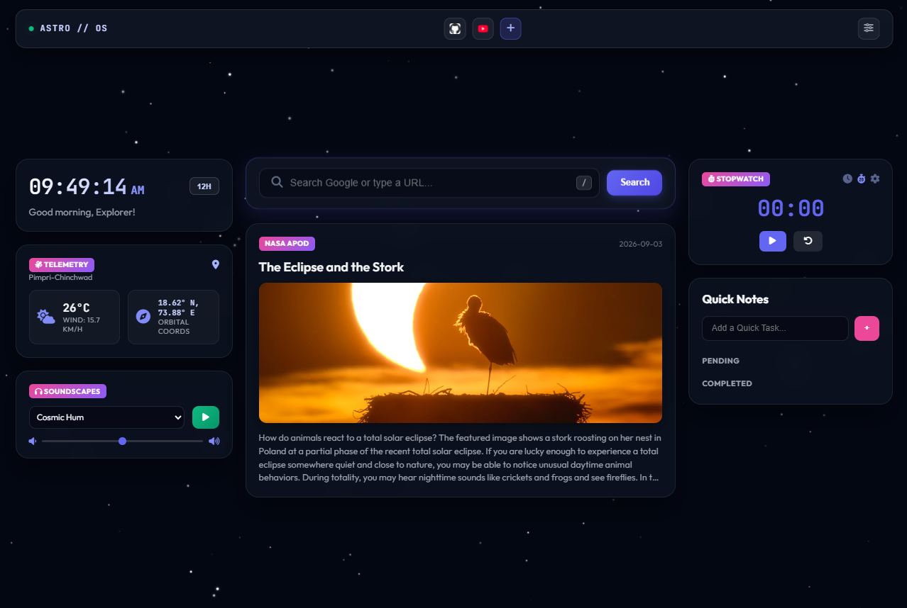
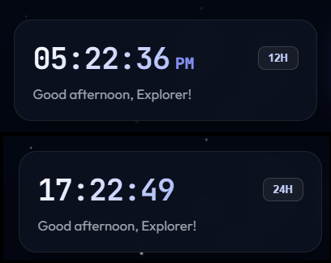
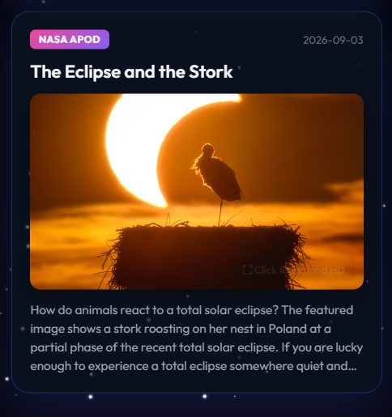
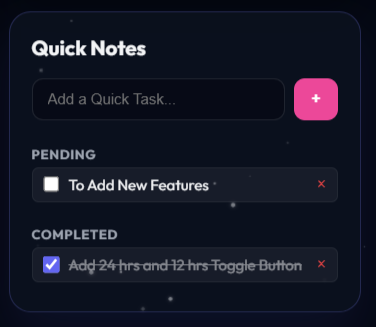
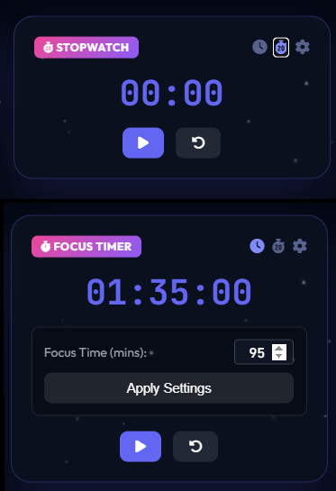
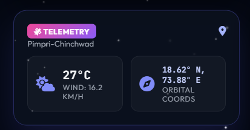
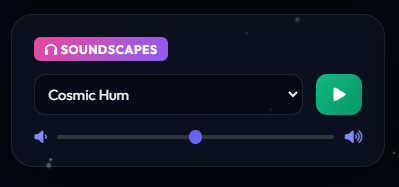
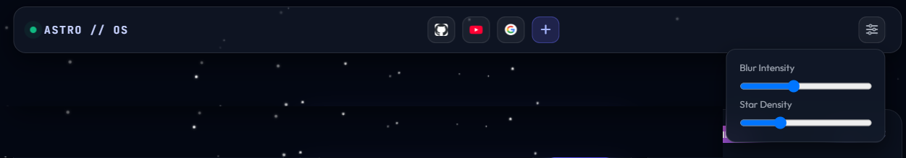
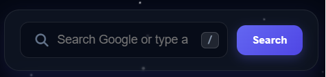
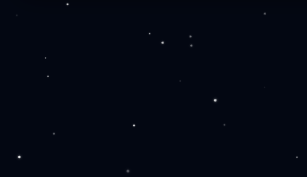

# AstroTab

AstroTab is a space-themed productivity dashboard I built around astronomy, with a few tools that I actually wanted to use while studying.

The main idea was to make a dashboard that feels like a small space command center while still being useful for everyday tasks.

It includes a real-time clock, NASA's Astronomy Picture of the Day, weather and orbital telemetry, quick notes, bookmarks, a Google search bar, ambient soundscapes, and a focus timer.

The focus timer supports both Pomodoro countdown and stopwatch modes, with custom session durations. I also added settings for things like starfield density, glass blur, sound volume, and location.

AstroTab uses NASA's APOD API for the astronomy content and Open-Meteo for weather and geocoding data. Some preferences and data are stored using localStorage so the dashboard can remember things between sessions.

I started building AstroTab as a simple HTML, CSS and JavaScript project, but as it grew I moved it to Vite to make development and organization easier.

Most of the project was built from scratch while experimenting with UI design, APIs, browser features, localStorage, Canvas, Web Audio API and responsive layouts.

## AstroTab Dashboard Features
* ### Digital Clock & Greeting Engine

<table>
  <tr>
    <td width="65%">
      <ul>
        <li>Real-time clock with dynamic AM/PM tracking.</li>
        <li>12-Hour and 24-Hour format toggling.</li>
        <li>Time-based greetings that change between Morning, Afternoon, and Evening.</li>
      </ul>
    </td>
    <td width="35%" align="center">
      
    </td>
  </tr>
</table>

  
* ### NASA APOD

<table>
  <tr>
    <td width="35%" align="center">
      
    </td>
    <td width="65%">
      <ul>
        <li>Daily astronomy images and video content fetched from NASA's APOD API.</li>
        <li>HD image viewing with an expanded modal.</li>
        <li>Support for both image and video APOD content.</li>
        <li>Cached APOD data using <code>localStorage</code>.</li>
        <li>Fallback content and error handling for API failures and rate limits.</li>
      </ul>
    </td>
  </tr>
</table>

* ### Quick Notes & Task Management

<table>
  <tr>
    <td width="65%">
      <ul>
        <li>Add and remove notes directly from the dashboard.</li>
        <li>Persistent storage using <code>localStorage</code>.</li>
        <li>Pending and completed task states with interactive checkboxes.</li>
        <li>Completed tasks receive visual cross-out styling.</li>
      </ul>
    </td>
    <td width="35%" align="center">
      
    </td>
  </tr>
</table>
  
* ### Focus Timer & Stopwatch

<table>
  <tr>
    <td width="35%" align="center">
      
    </td>
    <td width="65%">
      <ul>
        <li>Pomodoro countdown mode for focused sessions.</li>
        <li>Stopwatch mode for tracking elapsed time.</li>
        <li>Support for both image and video APOD content.</li>
        <li>Custom session durations from 1 to 180 minutes.</li>
        <li>Adaptive time display for both short and long sessions.</li>
        <li>Timer preferences saved using <code>localStorage</code>.
        <li>Start, pause, reset, and mode switching controls.</li>
      </ul>
    </td>
  </tr>
</table>

* ### Weather & Orbital Telemetry

<table>
  <tr>
    <td width="65%">
      <ul>
        <li>Live weather information using the Open-Meteo API.</li>
        <li>Current temperature and wind speed display.</li>
        <li>Latitude and longitude orbital/location telemetry.</li>
        <li>City search and geocoding modal for manually selecting locations.</li>
        <li>Automatic location detection with fallback handling.</li>
      </ul>
    </td>
    <td width="35%" align="center">
      
    </td>
  </tr>
</table>

* ### Cosmic Soundscapes

<table>
  <tr>
    <td width="35%" align="center">
      
    </td>
    <td width="65%">
      <ul>
        <li>Browser-based ambient sound generation using the Web Audio API.</li>
        <li>Cosmic and Rain sound profiles.</li>
        <li>Start and pause controls.</li>
        <li>Real-time volume adjustment with an inline slider.</li>
      </ul>
    </td>
  </tr>
</table>

* ### Bookmark Shortcuts

<table>
  <tr>
    <td width="65%">
      <ul>
        <li>Add custom website bookmarks through a glassmorphic modal.</li>
        <li>Automatic <code>https://</code> formatting for links.</li>
        <li>Website favicons for visual shortcuts.</li>
        <li>Remove bookmarks instantly.</li>
        <li>Persistent bookmark storage using <code>localStorage</code>.</li>
      </ul>
    </td>
    <td width="35%" align="center">
      
    </td>
  </tr>
</table>

* ### Google Search & URL Launcher

<table>
  <tr>
    <td width="35%" align="center">
      
    </td>
    <td width="65%">
      <ul>
        <li>Integrated Google search directly from the dashboard.</li>
        <li>Supports entering URLs for quick website access.</li>
        <li>Centered search interface integrated into the main dashboard layout.</li>
      </ul>
    </td>
  </tr>
</table>

* ### Interactive Canvas Starfield

<table>
  <tr>
  <td width="35%" align="center">
      
    </td>
    <td width="65%">
      <ul>
        <li>Animated HTML5 Canvas starfield background.</li>
        <li>Twinkling and pulsing star particles.</li>
        <li>Adjustable star density using a live slider.</li>
        <li>Real-time canvas updates when changing the density.</li>
      </ul>
    </td>
  </tr>
</table>

* ### Glassmorphism & Interface Customization

<table>
  <tr>
    <td width="65%">
      <ul>
        <li>Adjustable backdrop blur across dashboard cards.</li>
        <li>Live blur control for customizing the glassmorphism effect.</li>
        <li>Space-themed interface with responsive dashboard layout.</li>
        <li>Fixed navigation header for easier access while scrolling.</li>
      </ul>
    </td>
    <td width="35%" align="center">
      
    </td>
  </tr>
</table>

* ### API Resiliency & Error Handling

<table>
  <tr>
    <td width="65%">
      <ul>
        <li>Protected initialization for major dashboard modules.</li>
        <li>Handles NASA API rate limits and authentication errors.</li>
        <li>Fallback states when external APIs are unavailable.</li>
        <li>APOD support for different media types.</li>
        <li>Environment variables used for API configuration.</li>
      </ul>
    </td>
  </tr>
</table>

## AI Usage

I mainly built the project myself. I used GitHub Copilot only for minor assistance, mostly for code autocomplete and small suggestions while writing the project.

I also used AI for a little bit of help while connecting and working with APIs and understanding some implementation details. The overall design, features, structure and development of AstroTab were done by me.

This is the first shipped version of AstroTab. I have more ideas for it, but I'll be working on those in future development.

## Live Site

https://astrotab.vercel.app/

Built by Tanmay Pathe
